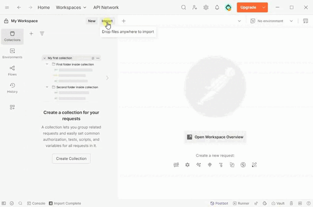

<h1>
  
  Digital Bookstore Management Application
</h1>

            <a href="#technologies">Technologies used</a> 🔹 
            <a href="#features">Features</a> 🔹 
            <a href="#technical-specifications">Technical Specifications</a> 🔹 
            <a href="#endpoints">Endpoints</a> 🔹 
            <a href="#how-to-use">How to Use the Project</a> 🔹 
            <a href="#contact-information">Contact Information</a>

<h2>✨ Product Description</h2>

A comprehensive web application designed to automate the process of selling books in the digital space. This solution is aimed at bookstore owners who want to efficiently manage their online store and provide high-quality service to customers.

<h2>🎯 Target Audience</h2>

<ul>
  <li> Bookstore owners</li>
  <li> Entrepreneurs in the book trade industry</li>
  <li> Companies specializing in the sale of printed and electronic literature</li>
</ul>

<h2>Technologies used ⚙️</h2>

<table>
  <tr>
    <td style="border: 1px solid #dbf9ff; padding: 8px; text-align: center;">
       Java 17
    </td>
    <td style="border: 1px solid #dbf9ff; padding: 8px; text-align: center;">
       Spring Boot
    </td>
    <td style="border: 1px solid #dbf9ff; padding: 8px; text-align: center;">
       Hibernate
    </td>
    <td style="border: 1px solid #dbf9ff; padding: 8px; text-align: center;">
       Spring Data JPA
    </td>
    <td style="border: 1px solid #dbf9ff; padding: 8px; text-align: center;">
       Spring Boot Security
    </td>
    <td style="border: 1px solid #dbf9ff; padding: 8px; text-align: center;">
       JWT
    </td>
  </tr>
  <tr>
    <td style="border: 1px solid #dbf9ff; padding: 8px; text-align: center;">
       MySQL 8
    </td>
    <td style="border: 1px solid #dbf9ff; padding: 8px; text-align: center;">
       Maven
    </td>
    <td style="border: 1px solid #dbf9ff; padding: 8px; text-align: center;">
       MapStruct
    </td>
    <td style="border: 1px solid #dbf9ff; padding: 8px; text-align: center;">
       Liquibase
    </td>
    <td style="border: 1px solid #dbf9ff; padding: 8px; text-align: center;">
       JUnit 5
    </td>
    <td style="border: 1px solid #dbf9ff; padding: 8px; text-align: center;">
       Mockito
    </td>
  </tr>
  <tr>
    <td style="border: 1px solid #dbf9ff; padding: 8px; text-align: center;">
       Testcontainers
    </td>
    <td style="border: 1px solid #dbf9ff; padding: 8px; text-align: center;">
       Docker
    </td>
    <td style="border: 1px solid #dbf9ff; padding: 8px; text-align: center;">
       Docker Compose
    </td>
    <td style="border: 1px solid #dbf9ff; padding: 8px; text-align: center;">
       Swagger
    </td>
    <td style="border: 1px solid #dbf9ff; padding: 8px; text-align: center;">
       Lombok
    </td>
    <td style="border: 1px solid #dbf9ff; padding: 8px; text-align: center;">
       Postman
    </td>
  </tr>
</table>

<h2>Features ✨</h2>

<h3>For Administrators 🛠️</h3>

<ul>
  <li><strong>Catalog Management</strong>: full cycle of book operations — adding, editing, and deleting items </li>
  <li><strong>Product Categorization</strong>: organizing books by genres for easy navigation </li>
  <li><strong>Order Processing</strong>: updating user order statuses </li>
</ul>

<h3>For Customers 🛒</h3>

<ul>
  <li><strong>Flexible Search</strong>: multi-criteria book search by title, author, genre, and price range </li>
  <li><strong>Shopping Cart</strong>: adding selected books and placing orders </li>
</ul>

<h2>Technical Specifications ⚙️</h2>

<h3>Security 🔐</h3>

<ul>
  <li><strong>Spring Security 6</strong>: modern application protection system </li>
  <li><strong>RBAC (Role-Based Access Control)</strong>: access rights management based on user roles </li>
  <li><strong>JWT Tokens</strong>: use of access and refresh tokens to ensure stateless architecture </li>
  <li><strong>Secure Authentication</strong>: reliable user login and authorization system </li>
</ul>

<h3>Reliability and Code Quality ✅</h3>

<ul>
  <li><strong>100% Test Coverage</strong>: all application layers (controllers, services, repositories) are fully tested </li>
  <li><strong>Modern Testing Tools</strong>: usage of Mockito and JUnit 5 </li>
  <li><strong>High Stability</strong>: risk minimization through comprehensive testing ️</li>
</ul>

<h2>Solution Advantages 🚀</h2>

<ul>
  <li>Full-featured bookstore management system </li>
  <li>High level of data security </li>
  <li>Scalable architecture </li>
</ul>

<h2>Endpoints 📡</h2>

<h3>Authentication Management 🔐</h3>
<table>
  <thead>
    <tr>
      <th>HTTP Request</th>
      <th>Endpoints</th>
      <th>Security requirement</th>
      <th>Description</th>
    </tr>
  </thead>
  <tbody>
    <tr>
      <td>POST</td>
      <td>/auth/login</td>
      <td>Public</td>
      <td>Authenticate users by email and password</td>
    </tr>
    <tr>
      <td>POST</td>
      <td>/auth/register</td>
      <td>Public</td>
      <td>Registration of new users</td>
    </tr>
    <tr>
      <td>POST</td>
      <td>/auth/token</td>
      <td>Public</td>
      <td>Get a new access token using refresh token</td>
    </tr>
    <tr>
      <td>POST</td>
      <td>/auth/refresh</td>
      <td>User</td>
      <td>Regenerate refresh and access tokens using access token</td>
    </tr>
  </tbody>
</table>

<h3>Book Management 📚</h3>
<table>
  <thead>
    <tr>
      <th>HTTP Request</th>
      <th>Endpoints</th>
      <th>Security requirement</th>
      <th>Description</th>
    </tr>
  </thead>
  <tbody>
    <tr>
      <td>GET</td>
      <td>/books</td>
      <td>User</td>
      <td>
        Get all books with pagination and sorting 
        <i>Example:</i> <code>/books?page=0&amp;size=10&amp;sort=title,DESC</code>
      </td>
    </tr>
    <tr>
      <td>GET</td>
      <td>/books/{bookId}</td>
      <td>User</td>
      <td>Get a book by its ID</td>
    </tr>
    <tr>
      <td>POST</td>
      <td>/books</td>
      <td>Admin</td>
      <td>Create a new book</td>
    </tr>
    <tr>
      <td>PATCH</td>
      <td>/books/{bookId}</td>
      <td>Admin</td>
      <td>Update book by its ID</td>
    </tr>
    <tr>
      <td>DELETE</td>
      <td>/books/{bookId}</td>
      <td>Admin</td>
      <td>Delete book by its ID</td>
    </tr>
    <tr>
      <td>GET</td>
      <td>/books/search</td>
      <td>User</td>
      <td>
        Search books by title, author, ISBN, or price range 
        <i>Example:</i> <code>/books/search?title=java&amp;page=0&amp;size=10</code>
      </td>
    </tr>
  </tbody>
</table>

<h3>Category Management 🗂️</h3>
<table>
  <thead>
    <tr>
      <th>HTTP Request</th>
      <th>Endpoints</th>
      <th>Security requirement</th>
      <th>Description</th>
    </tr>
  </thead>
  <tbody>
    <tr>
      <td>POST</td>
      <td>/categories</td>
      <td>Admin</td>
      <td>Create a new category</td>
    </tr>
    <tr>
      <td>GET</td>
      <td>/categories</td>
      <td>User</td>
      <td>
        Get all categories with pagination and sorting 
        <i>Example:</i> <code>/categories?page=0&amp;size=10&amp;sort=name</code>
      </td>
    </tr>
    <tr>
      <td>GET</td>
      <td>/categories/{categoryId}</td>
      <td>User</td>
      <td>Get a category by its ID</td>
    </tr>
    <tr>
      <td>PATCH</td>
      <td>/categories/{categoryId}</td>
      <td>Admin</td>
      <td>Update a category by its ID</td>
    </tr>
    <tr>
      <td>DELETE</td>
      <td>/categories/{categoryId}</td>
      <td>Admin</td>
      <td>Delete a category by its ID</td>
    </tr>
    <tr>
      <td>GET</td>
      <td>/categories/{categoryId}/books</td>
      <td>User</td>
      <td>
        Get list of books by category ID with pagination 
        <i>Example:</i> <code>/categories/3/books?page=0&amp;size=5</code>
      </td>
    </tr>
  </tbody>
</table>

<h3>Order Management 🛒</h3>
<table>
  <thead>
    <tr>
      <th>HTTP Request</th>
      <th>Endpoints</th>
      <th>Security requirement</th>
      <th>Description</th>
    </tr>
  </thead>
  <tbody>
    <tr>
      <td>POST</td>
      <td>/orders</td>
      <td>User</td>
      <td>Place a new order with shipping address</td>
    </tr>
    <tr>
      <td>PATCH</td>
      <td>/orders/cancel/{orderId}</td>
      <td>User</td>
      <td>Cancel an order if not yet processed</td>
    </tr>
    <tr>
      <td>GET</td>
      <td>/orders</td>
      <td>User</td>
      <td>Get all orders of the authenticated user with pagination</td>
    </tr>
    <tr>
      <td>PATCH</td>
      <td>/orders/{orderId}</td>
      <td>Admin</td>
      <td>Update order status (NEW, PROCESSED, SHIPPED, DELIVERED, CANCELED)</td>
    </tr>
    <tr>
      <td>GET</td>
      <td>/orders/{orderId}/items</td>
      <td>User</td>
      <td>Get all items in a specific order (paginated)</td>
    </tr>
    <tr>
      <td>GET</td>
      <td>/orders/{orderId}</td>
      <td>User</td>
      <td>Get order details by order ID</td>
    </tr>
    <tr>
      <td>GET</td>
      <td>/orders/{orderId}/items/{itemId}</td>
      <td>User</td>
      <td>Get specific item by order ID and item ID</td>
    </tr>
  </tbody>
</table>

<h3>Shopping Cart Management 🛍️</h3>
<table>
  <thead>
    <tr>
      <th>HTTP Request</th>
      <th>Endpoints</th>
      <th>Security requirement</th>
      <th>Description</th>
    </tr>
  </thead>
  <tbody>
    <tr>
      <td>GET</td>
      <td>/cart</td>
      <td>User</td>
      <td>Get the current user's shopping cart</td>
    </tr>
    <tr>
      <td>POST</td>
      <td>/cart</td>
      <td>User</td>
      <td>Add a book to the shopping cart</td>
    </tr>
    <tr>
      <td>DELETE</td>
      <td>/cart</td>
      <td>User</td>
      <td>Clear the current user's shopping cart</td>
    </tr>
    <tr>
      <td>PATCH</td>
      <td>/cart/items/{itemId}</td>
      <td>User</td>
      <td>Update quantity of a specific cart item</td>
    </tr>
    <tr>
      <td>DELETE</td>
      <td>/cart/items/{itemId}</td>
      <td>User</td>
      <td>Delete a specific cart item by its ID</td>
    </tr>
  </tbody>
</table>

<h3>User Management 👥</h3>
<table>
  <thead>
    <tr>
      <th>HTTP Request</th>
      <th>Endpoints</th>
      <th>Security requirement</th>
      <th>Description</th>
    </tr>
  </thead>
  <tbody>
    <tr>
      <td>PUT</td>
      <td>/users/{email}/role/{roleName}</td>
      <td>Admin</td>
      <td>Update user role by email and role name</td>
    </tr>
    <tr>
      <td>GET</td>
      <td>/users/me</td>
      <td>User</td>
      <td>Get information about the current user</td>
    </tr>
    <tr>
      <td>PATCH</td>
      <td>/users/me</td>
      <td>User</td>
      <td>Update current user's personal information</td>
    </tr>
  </tbody>
</table>

<h2>How to Use the Project 🛠️</h2>

<ol>
  <li>🐳 Install Docker</li>
  <li>
    📥 Clone the project from GitHub: 
    <code>git clone https://github.com/Serhii-Bohatkin/book_store</code>
  </li>
  <li>
    ⚙️ Create an <code>.env</code> file in the root directory. 
    Use <code>.env-sample</code> as a reference.
  </li>
  <li>
    🛠️ Build the project: 
    <code>mvn clean package</code>
  </li>
  <li>
    🚀 Start the app using Docker Compose: 
    <code>docker-compose up</code>
  </li>
  <li>
    🌐 Open Swagger UI: 
    <code>http://localhost:8081/swagger-ui/index.html</code> 
    port depends on your <code>.env</code> config.  For ease of testing, some books and categories have already been added to the database.
  </li>
</ol>

<h3>📭 You can also use Postman</h3>

  <ul>
    <li>
      <strong>Download the collection</strong> — 
      <a href="https://github.com/Serhii-Bohatkin/book_store/blob/master/book-store-postman-collection.json">click here</a> and import it into Postman
    </li>
    <li>
      Example of how to import the collection: 
      
    </li>
  </ul>

<h3>🔐 Using JWT Tokens via Postman</h3>

  
<strong>1. 📝 User Registration</strong> 
  Send a <code>POST</code> request to <code>/auth/register</code>  
  In the Body tab, select <strong>raw → JSON</strong> and provide:

  <pre><code>{
  "email": "admin@gmail.com",
  "password": "xBO4cH2f5603Na4ZteL!",
  "repeatPassword": "xBO4cH2f5603Na4ZteL!",
  "firstName": "Jhon",
  "lastName": "Doe",
  "shippingAddress": "St. Main 1",
  "inviteCode": "secretCodeForRegisteringTheFirstAdmin"
}</code></pre>

To register the first admin, use the email and invite code specified in your <code>.env</code> file.

<strong>2. 🔑 Login</strong> 
  Send a <code>POST</code> request to <code>/auth/login</code> 
  Provide credentials:

  <pre><code>{
  "email": "admin@gmail.com",
  "password": "xBO4cH2f5603Na4ZteL!"
}</code></pre>

The response contains both <code>accessToken</code> and <code>refreshToken</code>.

<strong>3. ✅ Access Protected Endpoints</strong> 
  In any authorized request (e.g., <code>GET /books</code>), go to the <strong>Authorization</strong> tab and set: 
  <code>Type: Bearer Token</code>  
  Paste your <code>accessToken</code> into the field.

<strong>4. ♻️ Refresh Access Token</strong> 
  Send a <code>POST</code> request to <code>/auth/token</code> 
  Body (raw → JSON):

  <pre><code>{
  "refreshToken": "yourRefreshToken"
}</code></pre>

You will receive a new <code>accessToken</code>.

<strong>5. 🔄 Regenerate Both Tokens</strong> 
  Send a <code>POST</code> request to <code>/auth/refresh</code> 
  Add header: 
  <code>Authorization: Bearer yourAccessToken</code> 
  You will receive new <code>accessToken</code> and <code>refreshToken</code>.

<h2>Contact Information 💬</h2>

<ul style="list-style-type:none; padding-left:0;">
  <li><strong>LinkedIn:</strong> <a href="https://linkedin.com/in/serhii-bohatkin" target="_blank" rel="noopener noreferrer">linkedin.com/in/serhii-bohatkin</a></li>
  <li><strong>Telegram:</strong> <a href="https://t.me/serhii_bohatkin" target="_blank" rel="noopener noreferrer">@serhii_bohatkin</a></li>
</ul>

Thank you for your attention!

  

  

